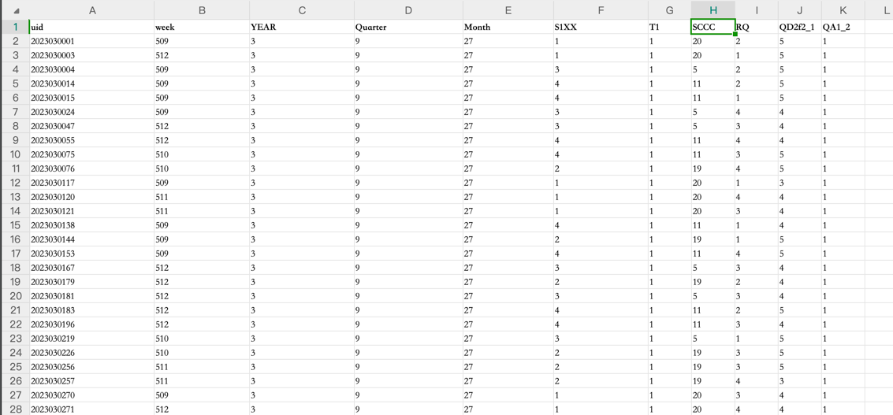
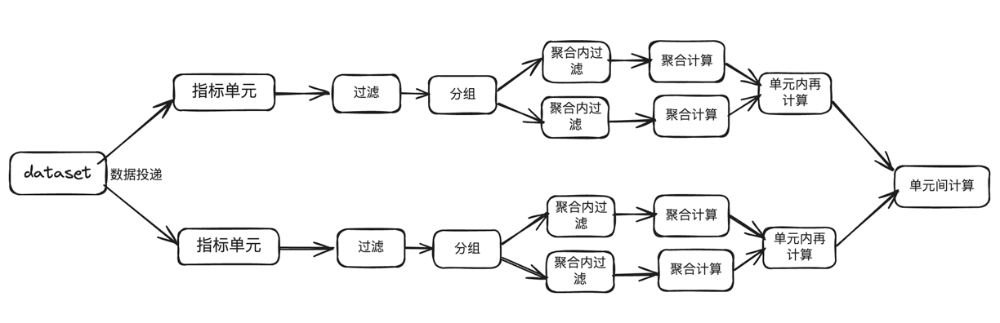

[(English Documents Available)](readme_en.md)

# soloscan

运行在JVM中的指标表达式，比写Sql简单，支持一个卡片多个指标同时计算。

## 特点

* 运行在JVM中，不依赖数据引擎的计算能力。
* 可一次计算多个指标表达式，不需要预计算。
* 支持通用的聚合方法(Max、Min、Avg、Sum、Count)，及聚合结果的再次计算。
* 支持分组、过滤、union等操作。
* 分组支持计算字段。
* 支持自定义普通函数、聚合函数。

### 表达式一些例子

* {count(SCCC),SCCC,SCCC in [5,11,9999]}
* {count(QD2f2_1 in [4,5])/count(QA1_2=1),week,week in range(513,520,1)}
* slide({count(QD2f2_1 in [4,5])/count(QA1_2=1),week,week in range(500,520,1)},4)
* {count(SCCC),SCCC,SCCC=5} union { count(SCCC),SCCC,SCCC=11 } union { count(SCCC),SCCC,SCCC=9 }

## 使用说明

### 表达式说明

* 指标表达式：由指标单元和单元间计算组成，主要是union计算，如：指标单元 union 指标单元。
* 指标单元：包括指标计算，分组，过滤三部分，形式：{指标计算,分组,过滤} or {指标计算,分组,过滤;指标计算,分组,过滤}
    * "{"开始，"}"结束，中间三部分以","分隔，第一部分是指标计算必须存在，第二部分为分组(可选，如果为空只需输入一个逗号)
      ，第三部分为过滤(可选)
    * 例子：{SUM(销售金额1)/SUM(销售金额2),销售日期,销售日期 >= '2022-01-01' AND 销售日期 <= '2022-12-31'}
        * 指标计算内容:SUM(销售金额1)/SUM(销售金额2)，分组内容：销售日期，过滤内容：销售日期 >= '2022-01-01' AND
          销售日期 <= '2022-12-31'
* 指标计算：聚合函数(字段, [过滤条件])，支持计算结果再次计算。
    * 例子：sum(SCCC) , sum(SCCC) / sum(SCCC1), sum(SCCC) / sum(SCCC1) / sum(SCCC2)
* 分组：字段（支持计算字段）。
    * 如果包括多个字段，形式："grouping(字段1,字段2, ...)"
* 过滤：过滤条件,支持数组比较、逻辑联合、小括号优先级，支持普通函数。

### 计算算子

* 数学计算： +、-、*、/、%
* 逻辑计算： || 、&&
* 比较计算： >、>=、=、<=、<
* 函数计算：聚合函数，普通函数，下面有说明
* 内置函数：range,in,slide
* 算子优先级： 遵循默认的算子优先级

| 优先级 | 运算符      | 关联性  | 类别    |
|-----|----------|------|-------|
| 1   | ()、[]    | 从左到右 | 后缀、列表 |
| 2   | *、/      | 从左到右 | 乘除    |
| 3   | +、-      | 从左到右 | 加减    |
| 4   | =、>、<、in | 从左到右 | 比较    |
| 5   | &&       | 从左到右 | 逻辑与   |
| 6   | \|\|     | 从左到右 | 逻辑或   |
| 6   | ?:       | 从左到右 | 三元    |


### 聚合函数

* Count
    * 语法：count(column)
    * 说明：column不为空计数
* Countblank
    * 语法：countblank(column)
    * 说明：column为空计数进行计数，与count(column==null)相同
* Average
    * 语法：Average(column)
    * 说明：返回列中所有数字的平均值（算术平均值）
* AverageX
    * 语法：AverageX(column,filter)
    * 说明：相对于Average，增加了一个过滤条件
* MAX
    * 语法：Max(column)
    * 说明：返回列中的最大值
* MAXX
    * 语法：Maxx(column,filter)
    * 说明：相对于max，增加了一个过滤条件
* MIN
    * 语法：Min(column)
    * 说明：返回列中的最小值
* MINx
    * 语法：Minx(column,filter)
    * 说明：相对于min，增加了一个过滤条件
* SUM
    * 语法：sum(column)
    * 说明：对某个列中的所有数值求和
* SUMx
    * 语法：sumx(column,filter)
    * 说明：相对于sum，增加了一个过滤条件

### 过滤条件

* 说明：计算出是否满足过滤条件，返回true或false
* 例子：column1 = 12 && column2>2 || ( column3 in range(2,1,10) && column4 in [1,2,3])

### 普通函数

* Range
    * 语法：RANGE (开始值,结束值,步长 )
        * 左闭右开
    * 例子：range(1,10,2)，返回 [1,3,5,7,9]
    * 说明：返回列表Range对象，支持in操作
* In
    * 语法： column in [1,2,3]
    * 说明：返回column是否在列表中
* Slide
    * 语法 Slide(指标结果,windowSize,stepSize)

### 项目例子


本例子使用excel作为dataset，第一行为列名，后面每一行为数据，列名大小写不敏感。

* 计算整个数据集的行数：{count()}。
* 计算SCCC不为空的行数：{count(SCCC)}。
* 计算SCCC不等于1的行数：{count(SCCC!=1)}
* 计算SCCC不等于1及以week分组：{count(SCCC!=1),week}
* 计算SCCC不等于1及RQ不等于1：{count(SCCC!=1),,RQ!=1}
* 计算SCCC不等于1及RQ不等于1且以week分组：{count(SCCC),week,RQ!=1}
    * {count(SCCC),week,RQ!=1} 与 {count(),week,SCCC!=null&&RQ!=1} 区别等同与sql中的集合函数中过滤和外部过滤的区别。
* 计算SCCC不等于1及RQ不等于1且以week分组，与count做default操作：{count(SCCC),week,RQ!=1;count(),week}
* 计算SCCC不等于1与count的占比及RQ不等于1且以week分组：{count(SCCC)/count(),week,RQ!=1}
* 计算SCCC不等于1与count的占比及RQ不等于1且以week分组 与 计算SCCC不等于1与count的占比及RQ等于1且以week分组 union :
  {count(SCCC)/count(),week,RQ!=1} union {count(SCCC)/count(),week,RQ=1}

## 开发使用

* maven依赖

```xml

<dependency>
    <groupId>io.github.hanzhihua-0725</groupId>
    <artifactId>soloscan</artifactId>
    <version>0.1.30</version>
</dependency>
```

* 代码使用

```java
DataSet dataSet=new ListDataSet<>(list);
SoloscanExecutorExt executorExt=SoloscanExecutorExt.INSTANCE;
Map<String, String> expressions=new HashMap<>();
expressions.put("metric1","{sum(col1),,}");
expressions.put("metric2","{count(col1),,}");
...
expressions.put("metricn","{count(col1),,}");
System.out.println(executorExt.execute(expressions,dataSet));
```
* DataSet使用

DataSet是一个接口，是传入表数据集的抽象，默认有ListDataSet，JDBCDataSet实现。

ListDataSet是一个Map<String,Object>的列表，里面的key是数据列名，value是数据列的值，这样很容易造成内存使用的放大

优化点：
1. key使用key.intern()，统一放入常量池中。
2. Map使用readonly map，减少map的扩容，推荐使用Guava的ImmutableMap。


## 系统设计

### 运行原理

指标表达式采用编译执行方式，使用asm生成jvm字节码，加载并生成相关的类和实例，然后执行。


### 表达式文法

算数运算符 ::= "+" | "-" | "*" | "/"

比较运算符 ::= "=" | "!=" | "<" | ">" | "<=" | ">="

逻辑运算符 ::= "&&" | "||" | "!"

聚合函数 ::= SUM | SUMX | MAX | MAXX | MIN | MINX | AVG | AVGX | COUNT | COUNTBLANK

ComparisonCondition ::= 字段 比较运算符 值

过滤部分 ::= ComparisonCondition (逻辑运算符 ComparisonCondition)*

聚合表达式 ::= 聚合函数(字段, 过滤部分)

计算部分 ::= 聚合表达式 (算数运算符 聚合表达式)*

分组部分 ::= 字段 ("," 字段)*

计算单元 ::= "{" 计算部分 "," 分组部分? "," 过滤部分? "}"

solo表达式 ::= 计算单元 (union 计算单元)*

### 编译时

语法分析出来的token，转成逆波兰表达式，然后通过asm生成类和实例。

### 运行时

语法分析出来的token会被转换成对应的SObject对象，然后通过SObject中的方法进行运算。

| 类型   | 例子                               | 运行时           |
|------|----------------------------------|---------------|
| 字符   | "xyz",'xyz'                      | SString       |
| 数字   | 22,22.2                          | SLong,SDouble |
| 变量   | xyz,TRUE                         | SVariable     |
| 操作符  | +,-,*,/,%,&&,\|\|,>,>=,=,<=,<,in | 对应SObject中的方法 |
| 函数   | xyz()                            | SFunction     |
| 聚合函数 | count()                          | AggFunction   |
| 计算单元 | {计算部分,分组部分,过滤部分}                 | SMetric       |

### 运行流程


