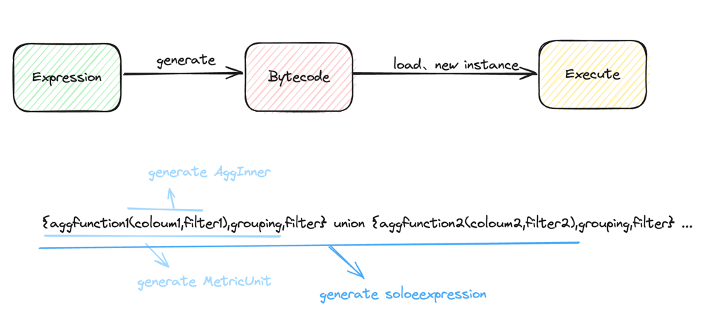

# soloscan

运行在JVM中的指标表达式。

## 特点
* 运行在JVM中，不依赖数据引擎的计算能力。
* 可一次计算多个指标表达式，不需要预计算。
* 支持通用的聚合方法(Max、Min、Avg、Sum、Count)，及聚合结果的再次计算。
* 支持分组、过滤、union等操作。
* 分组支持计算字段。
* 支持自定义普通函数、聚合函数。

### 表达式一些例子
* {count(SCCC),SCCC,SCCC in [5,11,9999]}
* {count(QD2f2_1 in [4,5])/count(QA1_2=1),week,week in range(513,520,1)}
* slide({count(QD2f2_1 in [4,5])/count(QA1_2=1),week,week in range(500,520,1)},4)
* {count(SCCC),SCCC,SCCC=5} union { count(SCCC),SCCC,SCCC=11 } union { count(SCCC),SCCC,SCCC=9 }

## 系统功能

### 表达式说明
* 包括指标表达式，指标单元，指标计算，分组，过滤等几部分。
* 指标表达式：指标单元 union 指标单元。
* 指标单元：{指标计算,分组,过滤} or {指标计算,分组,过滤;指标计算,分组,过滤}
  * 例子：{SUM(销售金额),销售日期,销售日期 >= '2022-01-01' AND 销售日期 <= '2022-12-31'}
* 指标计算：聚合函数(字段, [过滤条件])，支持计算结果再次计算。
* 分组：字段1[, 字段2, ...]，支持计算字段。
* 过滤：过滤条件,支持数组比较、逻辑联合、小括号优先级。

### 计算算子

* 数学计算： +、-、*、/、%
* 逻辑计算： || 、&&
* 比较计算： >、>=、=、<=、<
* 函数计算： 聚合函数、普通函数
* 算子优先级： 遵循默认的算子优先级

### 聚合函数
* Count
    * 语法：count(column)
    * 说明：column不为空计数
* Countblank
    * 语法：countblank(column)
    * 说明：column为空计数进行计数，与count(column==null)相同
* Average
    * 语法：Average(column)
    * 说明：返回列中所有数字的平均值（算术平均值）
* AverageX
    * 语法：AverageX(column,filter)
    * 说明：相对于Average，增加了一个过滤条件
* MAX
    * 语法：Max(column)
    * 说明：返回列中的最大值
* MAXX
    * 语法：Maxx(column,filter)
    * 说明：相对于max，增加了一个过滤条件
* MIN
    * 语法：Min(column)
    * 说明：返回列中的最小值
* MINx
    * 语法：Minx(column,filter)
    * 说明：相对于min，增加了一个过滤条件
* SUM
    * 语法：sum(column)
    * 说明：对某个列中的所有数值求和
* SUMx
    * 语法：sumx(column,filter)
    * 说明：相对于sum，增加了一个过滤条件

### 过滤条件
* 说明：计算出是否满足过滤条件，返回true或false
* 例子：column1 = 12 && column2>2 || ( column3 in range(2,1,10) && column4 in [1,2,3])

### 内部函数
* Range
    * 语法：RANGE (开始值,结束值,步长 )
        * 左闭右开
    * 例子：range(1,10,2)，返回 [1,3,5,7,9]
    * 说明：返回列表Range对象，支持in操作
* In
    * 语法： column in [1,2,3]
    * 说明：返回column是否在列表中
    * 
* Slide
  * 语法 Slide(指标结果,windowSize)

## 开发使用
* maven依赖
```xml
<dependency>
            <groupId>io.github.hanzhihua-0725</groupId>
            <artifactId>soloscan</artifactId>
            <version>0.1.2</version>
        </dependency>
```
* 代码使用
```java
DataSet dataSet = new ListDataSet<>(list);
        SoloscanExecutorExt executorExt = SoloscanExecutorExt.INSTANCE;
        Map<String,String> expressions = new HashMap<>();
        expressions.put("row1","{sum(col1),,}");
        expressions.put("row2","{count(col1),,}");
        ...
        expressions.put("rown","{count(col1),,}");
        System.out.println(executorExt.execute(expressions,dataSet));
```

## 系统设计

### 运行原理
指标表达式采用编译执行方式，使用asm生成jvm字节码，加载并生成相关的类和实例，然后执行。


### 表达式文法
算数运算符 ::= "+" | "-" | "*" | "/"

比较运算符 ::= "=" | "!=" | "<" | ">" | "<=" | ">="

逻辑运算符 ::= "&&" | "||" | "!"

聚合函数 ::= SUM | SUMX | MAX | MAXX | MIN | MINX | AVG | AVGX | COUNT | COUNTBLANK

ComparisonCondition ::= 字段 比较运算符 值

过滤部分 ::= ComparisonCondition (逻辑运算符 ComparisonCondition)*

聚合表达式 ::= 聚合函数(字段, 过滤部分)

计算部分 ::=  聚合表达式 (算数运算符 聚合表达式)*

分组部分 ::= 字段 ("," 字段)*

计算单元 ::= "{" 计算部分 "," 分组部分? "," 过滤部分? "}"

solo表达式 ::= 计算单元 (union 计算单元)*

### 编译时
语法分析出来的token，转成逆波兰表达式，然后通过asm生成类和实例。

### 运行时
语法分析出来的token会被转换成对应的SObject对象，然后通过SObject中的方法进行运算。

| 类型   | 例子                               | 运行时           |
|------|----------------------------------|---------------|
| 字符   | "xyz",'xyz'                      | SString       |
| 数字   | 22,22.2                          | SLong,SDouble |
| 变量   | xyz,TRUE                         | SVariable     |
| 操作符  | +,-,*,/,%,&&,\|\|,>,>=,=,<=,<,in | 对应SObject中的方法 |
| 函数   | xyz()                            | SFunction     |
| 聚合函数 | count()、average()                | SFunction     |
| 计算单元 | {计算部分,分组部分,过滤部分}          | SMetric       |

### 运行流程
* DataSet 是soloscan输入数据集对象，数据可以理解为list<Map<String,Object>>，支持jdbc resultset的适配
* 通过对DataSet进行迭代，计算出所有的聚合函数的数据
* 然后在计算出计算单元的计算结果
* 最后计算出solo表达式的计算结果
