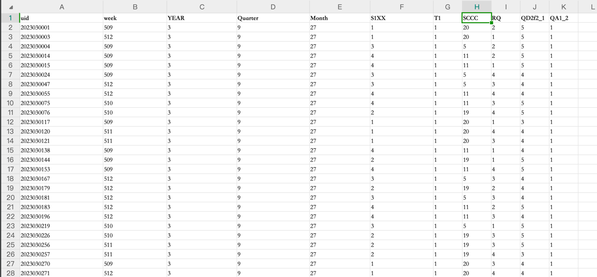
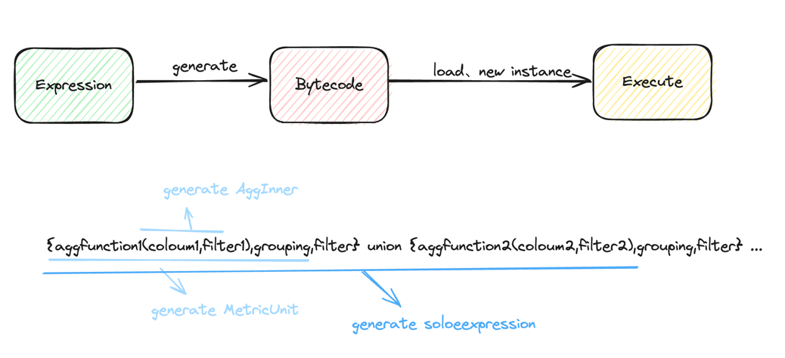
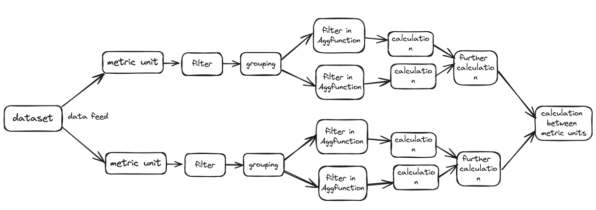

# soloscan

Metric expressions running on the JVM.

## Features
* Runs on the JVM, independent of data engine computing power.
* Can calculate multiple metric expressions at once, without pre-calculation.
* Supports common aggregation methods (Max, Min, Avg, Sum, Count) and further calculation of aggregation results.
* Supports operations like grouping, filtering, and union.
* Grouping supports calculated fields.
* Supports custom ordinary functions and aggregation functions.

## Examples of expressions
* {count(SCCC),SCCC,SCCC in [5,11,9999]}
* {count(QD2f2_1 in [4,5])/count(QA1_2=1),week,week in range(513,520,1)}
* slide({count(QD2f2_1 in [4,5])/count(QA1_2=1),week,week in range(500,520,1)},4)
* {count(SCCC),SCCC,SCCC=5} union { count(SCCC),SCCC,SCCC=11 } union { count(SCCC),SCCC,SCCC=9 }

## Instructions
### Expression explanation
* Metric expression: Composed of metric units and calculations between units, mainly union calculations, e.g., metric unit union metric unit.
* Metric unit: Includes metric calculation, grouping, and filtering in three parts, in the form: {metric calculation, grouping, filtering} or {metric calculation, grouping, filtering; metric calculation, grouping, filtering}
  * Starts with "{", ends with "}", the three parts are separated by ",", the first part is the metric calculation which is required, the second part is grouping (optional, if empty, just input a comma), and the third part is filtering (optional).
  * Example: {SUM(SalesAmount1)/SUM(SalesAmount2), SalesDate, SalesDate >= '2022-01-01' AND SalesDate <= '2022-12-31'}
    * Metric calculation content: SUM(SalesAmount1)/SUM(SalesAmount2), grouping content: SalesDate, filtering content: SalesDate >= '2022-01-01' AND SalesDate <= '2022-12-31'
* Metric calculation: Aggregation function (field, [filter condition]), supports further calculation of results.
  * Example: sum(SCCC), sum(SCCC) / sum(SCCC1), sum(SCCC) / sum(SCCC1) / sum(SCCC2)
* Grouping: Field (supports calculated fields).
  * If multiple fields are included, the format is: "grouping(field1, field2, ...)"
* Filtering: Filter conditions, supports array comparison, logical union, parentheses precedence, and ordinary functions.

### Calculation operators
* Mathematical calculation: +, -, *, /, %
* Logical calculation: ||, &&
* Comparison calculation: >, >=, =, <=, <
* Function calculation: Aggregation functions, ordinary functions, explained below
* Operator precedence: Follows default operator precedence

### Aggregation functions
* Count
    * Syntax: count(column)
    * Description: Counts non-null columns
* Countblank
  * Syntax: countblank(column)
  * Description: Counts null columns, equivalent to count(column==null)
* Average
  * Syntax: Average(column)
  * Description: Returns the arithmetic mean of all numbers in the column
* AverageX
  * Syntax: AverageX(column, filter)
  * Description: Adds a filter condition to Average
* MAX
  * Syntax: Max(column)
  * Description: Returns the maximum value in the column
* MAXX
  * Syntax: Maxx(column, filter)
  * Description: Adds a filter condition to max
* MIN
  * Syntax: Min(column)
  * Description: Returns the minimum value in the column
* MINx
  * Syntax: Minx(column, filter)
  * Description: Adds a filter condition to min
* SUM
  * Syntax: sum(column)
  * Description: Sums all values in a column
* SUMx
  * Syntax: sumx(column, filter)
  * Description: Adds a filter condition to sum

### Filter conditions
* Description: Calculates whether the filter conditions are met, returns true or false
* Example: column1 = 12 && column2>2 || ( column3 in range(2,1,10) && column4 in [1,2,3])

### Ordinary functions
* Range
  * Syntax: RANGE(start value, end value, step size)
    * Left-closed and right-open
  * Example: range(1,10,2), returns [1,3,5,7,9]
  * Description: Returns a list Range object, supports in operation
* In
  * Syntax: column in [1,2,3]
  * Description: Returns whether column is in the list
* Slide
  * Syntax: Slide(metric result, windowSize)

### Project Examples

This example uses Excel as the dataset, with the first row being the column names and each subsequent row being the data. Column names are case insensitive.

* Calculate the number of rows in the entire dataset: {count()}.
* Calculate the number of rows where SCCC is not null: {count(SCCC)}.
* Calculate the number of rows where SCCC is not equal to 1: {count(SCCC!=1)}
* Calculate the number of rows where SCCC is not equal to 1 and group by week: {count(SCCC!=1),week}
* Calculate the number of rows where SCCC is not equal to 1 and RQ is not equal to 1: {count(SCCC!=1),,RQ!=1}
* Calculate the number of rows where SCCC is not equal to 1 and RQ is not equal to 1, and group by week: {count(SCCC),week,RQ!=1}
  * {count(SCCC),week,RQ!=1} and {count(),week,SCCC!=null&&RQ!=1}  is equivalent to the difference between filtering within the aggregation function and external filtering in SQL.
* Calculate the number of rows where SCCC is not equal to 1 and RQ is not equal to 1, and group by week, with a default operation for count: {count(SCCC),week,RQ!=1;count(),week}
* Calculate the ratio of SCCC not equal to 1 to count, and RQ not equal to 1, grouped by week: {count(SCCC)/count(),week,RQ!=1}
* Calculate the ratio of SCCC not equal to 1 to count, and RQ not equal to 1, grouped by week, and the ratio of SCCC not equal to 1 to count, and RQ equal to 1, grouped by week, union: {count(SCCC)/count(),week,RQ!=1} union {count(SCCC)/count(),week,RQ=1}

## Development Usage

* Maven dependencies
```xml
<dependency>
  <groupId>io.github.hanzhihua-0725</groupId>
  <artifactId>soloscan</artifactId>
  <version>0.1.8</version>
</dependency>
```
* Code usage
```java
DataSet dataSet = new ListDataSet<>(list);
SoloscanExecutorExt executorExt = SoloscanExecutorExt.INSTANCE;
Map<String,String> expressions = new HashMap<>();
expressions.put("row1","{sum(col1),,}");
expressions.put("row2","{count(col1),,}");
...
expressions.put("rown","{count(col1),,}");
System.out.println(executorExt.execute(expressions,dataSet));
```

## System Design
### Operating Principle
The metric expression adopts a compiled execution method, using ASM to generate JVM bytecode, loading and generating related classes and instances, and then executing.


### Expression Grammar
Arithmetic Operators ::= "+" | "-" | "*" | "/"

Comparison Operators ::= "=" | "!=" | "<" | ">" | "<=" | ">="

Logical Operators ::= "&&" | "||" | "!"

Aggregation Functions ::= SUM | SUMX | MAX | MAXX | MIN | MINX | AVG | AVGX | COUNT | COUNTBLANK

ComparisonCondition ::= Field Comparison Operators Value

Filter Part ::= ComparisonCondition (Logical Operators ComparisonCondition)*

Aggregation Expression ::= Aggregation Functions(Field, Filter Part)

Calculation Part ::= Aggregation Expression (Arithmetic Operators Aggregation Expression)*

Grouping Part ::= Field ("," Field)*

Calculation Unit ::= "{" Calculation Part "," Grouping Part? "," Filter Part? "}"

Solo Expression ::= Calculation Unit (union Calculation Unit)*

### Compilation
Tokens parsed from the syntax are converted into reverse Polish notation, and then classes and instances are generated through ASM.

### Runtime
Tokens parsed from the syntax are converted into corresponding SObject objects, and then operations are performed through the methods in SObject

| Type | Example                          | Runtime       |
|------|----------------------------------|---------------|
| String   | "xyz",'xyz'                      | SString       |
| Number   | 22,22.2                          | SLong,SDouble |
| Variable   | xyz,TRUE                         | SVariable     |
| Operator  | +,-,*,/,%,&&,\|\|,>,>=,=,<=,<,in | 对应SObject中的方法 |
| Function   | xyz()                            | SFunction     |
| Aggregation Function | count()                          | AggFunction   |
| Calculation Unit | {Calculation Part, Grouping Part, Filter Part}              | SMetric       |

### Execution Process

